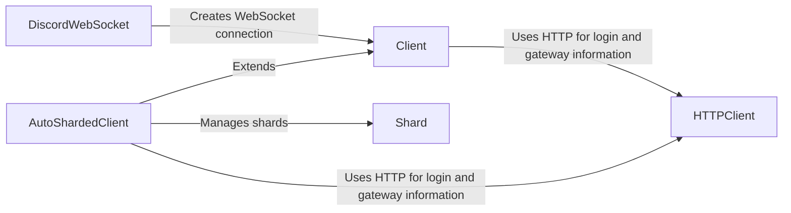

## Component Details

The Client Manager is responsible for managing the bot's connection to Discord, handling user authentication, and dispatching events. It orchestrates the bot's lifecycle, including connecting to the gateway, handling reconnections, and managing sharding for larger bots to improve performance and scalability. The core components involved are the Client, AutoShardedClient, Shard, DiscordWebSocket, and HTTPClient, which work together to establish and maintain the connection, manage shards, and handle API requests.

### Client
The Client class represents the main interface to the Discord API. It handles connecting to Discord, managing events, and providing access to other API functionality. It uses HTTPClient for login and gateway information.
- **Related Classes/Methods**: `discord.client.Client.__init__` (275:318), `discord.client.Client.login` (620:666), `discord.client.Client.connect` (668:764), `discord.client.Client.close` (766:788), `discord.client.Client.start` (802:824), `discord.client.Client.run` (826:911), `discord.client.Client` (153:3289)

### AutoShardedClient
The AutoShardedClient is a subclass of Client that automatically manages sharding for larger bots. It handles distributing the bot across multiple shards to improve performance and scalability. It extends the Client class and uses HTTPClient for login and gateway information. It also manages Shard instances.
- **Related Classes/Methods**: `discord.shard.AutoShardedClient.get_shard` (422:440), `discord.shard.AutoShardedClient.shards` (443:445), `discord.shard.AutoShardedClient.fetch_session_start_limits` (447:472), `discord.shard.AutoShardedClient.launch_shard` (474:485), `discord.shard.AutoShardedClient.launch_shards` (487:505), `discord.shard.AutoShardedClient.connect` (511:533), `discord.shard.AutoShardedClient.close` (535:554), `discord.shard.AutoShardedClient` (325:638)

### Shard
The Shard class represents a single shard connection to Discord. It handles the WebSocket connection, event processing, and reconnection logic for a specific shard.
- **Related Classes/Methods**: `discord.shard.Shard.launch` (120:121), `discord.shard.Shard.close` (127:129), `discord.shard.Shard.disconnect` (131:133), `discord.shard.Shard._handle_disconnect` (135:162), `discord.shard.Shard.worker` (164:179), `discord.shard.Shard.reidentify` (181:207), `discord.shard.Shard.reconnect` (209:221), `discord.shard.Shard` (96:221)

### DiscordWebSocket
The DiscordWebSocket class manages the underlying WebSocket connection to Discord. It handles sending and receiving data, heartbeating, and connection management. It is created from the Client.
- **Related Classes/Methods**: `discord.gateway.DiscordWebSocket.from_client` (346:409), `discord.gateway.DiscordWebSocket` (245:763)

### HTTPClient
The HTTPClient class handles making HTTP requests to the Discord API. It is responsible for authentication, rate limiting, and error handling. It is used by Client and AutoShardedClient for login and gateway information.
- **Related Classes/Methods**: `discord.http.HTTPClient.static_login` (810:835), `discord.http.HTTPClient.get_bot_gateway` (2764:2770), `discord.http.HTTPClient` (500:2773)