```mermaid
graph LR
    CommandTree["CommandTree"]
    App_Command_Command_ContextMenu_Group_["App Command (Command, ContextMenu, Group)"]
    App_Command_Decorators["App Command Decorators"]
    BotBase_discord_ext_commands_["BotBase (discord.ext.commands)"]
    Command_discord_ext_commands_["Command (discord.ext.commands)"]
    GroupMixin_discord_ext_commands_["GroupMixin (discord.ext.commands)"]
    Group_discord_ext_commands_["Group (discord.ext.commands)"]
    Context_discord_ext_commands_["Context (discord.ext.commands)"]
    HybridAppCommand["HybridAppCommand"]
    HybridCommand["HybridCommand"]
    HybridGroup["HybridGroup"]
    CommandTree -- "manages" --> App_Command_Command_ContextMenu_Group_
    BotBase_discord_ext_commands_ -- "registers commands with" --> CommandTree
    BotBase_discord_ext_commands_ -- "creates hybrid commands" --> HybridCommand
    BotBase_discord_ext_commands_ -- "creates hybrid groups" --> HybridGroup
    HybridAppCommand -- "is a base class for" --> HybridCommand
    HybridAppCommand -- "is a base class for" --> HybridGroup
    HybridCommand -- "inherits from" --> Command_discord_ext_commands_
    HybridGroup -- "inherits from" --> Group_discord_ext_commands_
    Context_discord_ext_commands_ -- "provides context for" --> Command_discord_ext_commands_
    Context_discord_ext_commands_ -- "provides context for" --> HybridCommand
    GroupMixin_discord_ext_commands_ -- "manages subcommands" --> Command_discord_ext_commands_
    Group_discord_ext_commands_ -- "inherits from" --> Command_discord_ext_commands_
    Group_discord_ext_commands_ -- "inherits from" --> GroupMixin_discord_ext_commands_
    HybridCommand -- "inherits from" --> HybridAppCommand
    HybridGroup -- "inherits from" --> HybridAppCommand
```

## Component Details

The Command Handler component is responsible for managing and processing both application commands (slash commands and context menu commands) and traditional text-based commands within a Discord bot. It encompasses the registration, parsing, and execution of these commands, providing a unified interface for developers to create interactive and feature-rich bots. The core functionality revolves around the `CommandTree` for application commands and the `discord.ext.commands` framework for text commands, with hybrid commands bridging the gap between the two.

### CommandTree
Manages application commands (slash commands and context menu commands) for a Discord bot. It provides methods to add, retrieve, and synchronize commands with Discord. It also handles command invocation from interactions.
- **Related Classes/Methods**: `discord.app_commands.tree.CommandTree` (111:1317), `discord.app_commands.tree.CommandTree:add_command` (287:412), `discord.app_commands.tree.CommandTree:get_commands` (611:617), `discord.app_commands.tree.CommandTree:command` (865:947), `discord.app_commands.tree.CommandTree:context_menu` (949:1035), `discord.app_commands.tree.CommandTree:sync` (1079:1137), `discord.app_commands.tree.CommandTree:_from_interaction` (1148:1155), `discord.app_commands.tree.CommandTree:_call` (1271:1317)

### App Command (Command, ContextMenu, Group)
Represents the base class for application commands, including slash commands (Command), context menu commands (ContextMenu), and command groups (Group). It handles command registration, payload generation for Discord, and invocation logic.
- **Related Classes/Methods**: `discord.app_commands.commands.Command` (568:1149), `discord.app_commands.commands.Command:__init__` (651:710), `discord.app_commands.commands.Command:get_translated_payload` (749:774), `discord.app_commands.commands.Command:_invoke_with_namespace` (878:883), `discord.app_commands.commands.Command:parameters` (933:943), `discord.app_commands.commands.Command:get_parameter` (945:965), `discord.app_commands.commands.Command:autocomplete` (1045:1119), `discord.app_commands.commands.ContextMenu` (1152:1381), `discord.app_commands.commands.ContextMenu:__init__` (1224:1270), `discord.app_commands.commands.ContextMenu:get_translated_payload` (1282:1293), `discord.app_commands.commands.ContextMenu:_invoke` (1316:1325), `discord.app_commands.commands.Group` (1384:2011), `discord.app_commands.commands.Group:__init_subclass__` (1495:1547), `discord.app_commands.commands.Group:__init__` (1549:1669), `discord.app_commands.commands.Group:get_translated_payload` (1716:1738), `discord.app_commands.commands.Group:command` (1954:2011)

### App Command Decorators
These decorators (`command`, `context_menu`, `describe`, `rename`, `choices`, `autocomplete`, `guild_only`, `private_channel_only`, `dm_only`, `guild_install`, `user_install`) are used to define and configure application commands. They provide a convenient way to register commands and set their properties.
- **Related Classes/Methods**: `discord.app_commands.commands:command` (2014:2070), `discord.app_commands.commands:context_menu` (2073:2133), `discord.app_commands.commands:describe` (2136:2188), `discord.app_commands.commands:rename` (2191:2231), `discord.app_commands.commands:choices` (2234:2300), `discord.app_commands.commands:autocomplete` (2303:2359), `discord.app_commands.commands:guild_only` (2479:2480), `discord.app_commands.commands:private_channel_only` (2533:2534), `discord.app_commands.commands:dm_only` (2587:2588), `discord.app_commands.commands:guild_install` (2682:2683), `discord.app_commands.commands:user_install` (2732:2733)

### BotBase (discord.ext.commands)
The BotBase class (from `discord.ext.commands`) serves as the foundation for bot implementations using the `discord.ext.commands` extension. It manages command registration, removal, and processing, including hybrid commands (which can be invoked both via text commands and application commands).
- **Related Classes/Methods**: `discord.ext.commands.bot.BotBase` (161:1411), `discord.ext.commands.bot.BotBase:__init__` (162:205), `discord.ext.commands.bot.BotBase:add_command` (252:260), `discord.ext.commands.bot.BotBase:remove_command` (263:277), `discord.ext.commands.bot.BotBase:hybrid_command` (279:301), `discord.ext.commands.bot.BotBase:hybrid_group` (303:325), `discord.ext.commands.bot.BotBase:get_context` (1231:1236), `discord.ext.commands.bot.BotBase:invoke` (1347:1375), `discord.ext.commands.bot.BotBase:process_commands` (1377:1408)

### Command (discord.ext.commands)
The Command class (from `discord.ext.commands`) represents a text-based command. It handles argument parsing, callback invocation, error handling, and command preparation.
- **Related Classes/Methods**: `discord.ext.commands.core.Command` (296:1290), `discord.ext.commands.core.Command:__init__` (389:480), `discord.ext.commands.core.Command:callback` (491:494), `discord.ext.commands.core.Command:copy` (609:618), `discord.ext.commands.core.Command:_update_copy` (620:627), `discord.ext.commands.core.Command:dispatch_error` (629:650), `discord.ext.commands.core.Command:transform` (652:715), `discord.ext.commands.core.Command:_parse_arguments` (832:866), `discord.ext.commands.core.Command:prepare` (922:944), `discord.ext.commands.core.Command:invoke` (1020:1029), `discord.ext.commands.core.Command:reinvoke` (1031:1046)

### GroupMixin (discord.ext.commands)
The GroupMixin class (from `discord.ext.commands`) provides functionality for creating command groups. It allows adding, removing, and retrieving subcommands within a group.
- **Related Classes/Methods**: `discord.ext.commands.core.GroupMixin` (1293:1583), `discord.ext.commands.core.GroupMixin:__init__` (1306:1310), `discord.ext.commands.core.GroupMixin:recursively_remove_all_commands` (1317:1321), `discord.ext.commands.core.GroupMixin:add_command` (1323:1363), `discord.ext.commands.core.GroupMixin:remove_command` (1365:1404), `discord.ext.commands.core.GroupMixin:get_command` (1422:1464), `discord.ext.commands.core.GroupMixin:command` (1467:1481), `discord.ext.commands.core.GroupMixin:group` (1527:1541)

### Group (discord.ext.commands)
The Group class (from `discord.ext.commands`) represents a command group, inheriting from both Command and GroupMixin. It combines the features of a command with the ability to contain subcommands.
- **Related Classes/Methods**: `discord.ext.commands.core.Group` (1586:1695), `discord.ext.commands.core.Group:__init__` (1609:1611), `discord.ext.commands.core.Group:copy` (1613:1624), `discord.ext.commands.core.Group:invoke` (1626:1655), `discord.ext.commands.core.Group:reinvoke` (1657:1695), `discord.ext.commands.core:group` (1799:1803)

### Context (discord.ext.commands)
The Context class (from `discord.ext.commands`) provides context for command invocation, including information about the message, channel, and author. It also includes methods for sending messages and help messages.
- **Related Classes/Methods**: `discord.ext.commands.context.Context` (109:1089), `discord.ext.commands.context.Context:from_interaction` (218:304), `discord.ext.commands.context.Context:send_help` (549:629), `discord.ext.commands.context.Context:reply` (632:651)

### HybridAppCommand
The HybridAppCommand class serves as a base class for hybrid commands, which can be invoked both as application commands and text commands. It handles argument transformation and command execution logic.
- **Related Classes/Methods**: `discord.ext.commands.hybrid.HybridAppCommand` (305:478), `discord.ext.commands.hybrid.HybridAppCommand:__init__` (308:333), `discord.ext.commands.hybrid.HybridAppCommand:_copy_with` (335:339), `discord.ext.commands.hybrid.HybridAppCommand:copy` (341:345), `discord.ext.commands.hybrid.HybridAppCommand:_transform_arguments` (347:380), `discord.ext.commands.hybrid.HybridAppCommand:_check_can_run` (382:433), `discord.ext.commands.hybrid.HybridAppCommand:_invoke_with_namespace` (435:478)

### HybridCommand
The HybridCommand class represents a hybrid command, inheriting from both Command and HybridAppCommand. It combines the features of a text command with the ability to be invoked as an application command.
- **Related Classes/Methods**: `discord.ext.commands.hybrid.HybridCommand` (481:587), `discord.ext.commands.hybrid.HybridCommand:__init__` (497:522), `discord.ext.commands.hybrid.HybridCommand:can_run` (534:541), `discord.ext.commands.hybrid.HybridCommand:_parse_arguments` (543:548), `discord.ext.commands.hybrid.HybridCommand:_ensure_assignment_on_copy` (550:557), `discord.ext.commands.hybrid.HybridCommand:autocomplete` (559:587)

### HybridGroup
The HybridGroup class represents a hybrid command group, inheriting from both Group and HybridAppCommand. It combines the features of a command group with the ability to be invoked as an application command group.
- **Related Classes/Methods**: `discord.ext.commands.hybrid.HybridGroup` (590:869), `discord.ext.commands.hybrid.HybridGroup:__init__` (618:684), `discord.ext.commands.hybrid.HybridGroup:_fallback_command` (687:690), `discord.ext.commands.hybrid.HybridGroup:add_command` (777:815), `discord.ext.commands.hybrid.HybridGroup:remove_command` (817:821), `discord.ext.commands.hybrid.HybridGroup:command` (823:845), `discord.ext.commands.hybrid.HybridGroup:group` (847:869), `discord.ext.commands.hybrid:hybrid_command` (872:921), `discord.ext.commands.hybrid:hybrid_group` (924:954)