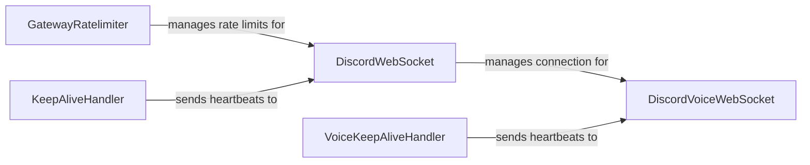

## Component Details

The Gateway Handler manages real-time communication with Discord's servers via WebSockets. It encompasses connection management, event handling, heartbeating, and reconnection logic for both the main Discord gateway and voice connections. The core components ensure a stable and efficient communication channel for sending and receiving data, including voice data, while adhering to Discord's rate limits and protocol requirements.

### DiscordWebSocket
Manages the primary WebSocket connection to Discord's gateway. It handles sending and receiving JSON messages, managing heartbeats to keep the connection alive, identifying the client to Discord, resuming sessions if the connection is interrupted, and handling rate limits. It interacts with GatewayRatelimiter to ensure compliance with Discord's API limits and KeepAliveHandler to maintain the connection.
- **Related Classes/Methods**: `discord.gateway.DiscordWebSocket` (245:763), `discord.gateway.DiscordWebSocket:send` (657:659), `discord.gateway.DiscordWebSocket:received_message` (490:599), `discord.gateway.DiscordWebSocket:close` (757:763)

### DiscordVoiceWebSocket
Manages the WebSocket connection specifically for voice communication with Discord. It handles tasks such as establishing the connection, selecting the appropriate voice protocol, managing voice states, sending audio data, and handling encryption. It also supports resuming voice sessions and initial connection setup. It interacts with VoiceKeepAliveHandler to maintain the voice connection.
- **Related Classes/Methods**: `discord.gateway.DiscordVoiceWebSocket` (769:1046), `discord.gateway.DiscordVoiceWebSocket:send` (336:339), `discord.gateway.DiscordVoiceWebSocket:received_message` (933:953), `discord.gateway.DiscordVoiceWebSocket:close` (1041:1046)

### GatewayRatelimiter
Manages rate limits for sending messages to the Discord gateway. It provides a mechanism to block the sending of messages until the rate limit is cleared, preventing the bot from being banned for exceeding Discord's API usage limits. It is used by DiscordWebSocket to regulate message sending.
- **Related Classes/Methods**: `discord.gateway.GatewayRatelimiter` (87:123), `discord.gateway.GatewayRatelimiter:block` (118:123)

### KeepAliveHandler
Responsible for sending heartbeats to the Discord gateway at regular intervals. These heartbeats are crucial for maintaining a stable connection and preventing the gateway from closing the connection due to inactivity. It is used by DiscordWebSocket to send heartbeats.
- **Related Classes/Methods**: `discord.gateway.KeepAliveHandler` (126:211), `discord.gateway.KeepAliveHandler:run` (152:192)

### VoiceKeepAliveHandler
Similar to KeepAliveHandler, but specifically for voice connections. It sends heartbeats to the Discord voice gateway to ensure the voice connection remains active. It is used by DiscordVoiceWebSocket to send voice heartbeats.
- **Related Classes/Methods**: `discord.gateway.VoiceKeepAliveHandler` (214:234), `discord.gateway.VoiceKeepAliveHandler:__init__` (215:221)