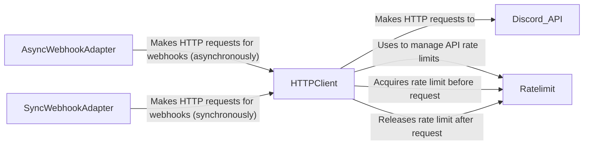

## Component Details

The HTTP Abstraction component is responsible for handling HTTP requests to the Discord API, managing rate limits, and providing a consistent interface for other components to interact with the API. It encapsulates the complexity of making HTTP requests, handling authentication, and dealing with rate limits to prevent the bot from being rate-limited by Discord. The component uses asynchronous and synchronous webhook adapters for webhook-related requests.

### HTTPClient
The HTTPClient class is the core of the HTTP abstraction, responsible for making HTTP requests to the Discord API. It handles authentication, request formatting, and response processing. It also manages rate limits to avoid exceeding the API's usage limits by interacting with the Ratelimit class. It uses AsyncWebhookAdapter for asynchronous webhook requests and SyncWebhookAdapter for synchronous webhook requests.
- **Related Classes/Methods**: `discord.http.HTTPClient` (500:2773), `discord.http.HTTPClient:request` (572:779), `discord.http.HTTPClient:static_login` (810:835), `discord.http.HTTPClient:logout` (837:838), `discord.http.HTTPClient:get_ratelimit` (564:570)

### Ratelimit
The Ratelimit class is responsible for managing rate limits for different Discord API endpoints. It uses a lock to ensure that only one request is made at a time for a given endpoint. It interacts with the HTTPClient class to acquire and release rate limit locks before and after making requests, preventing the bot from being rate-limited by Discord.
- **Related Classes/Methods**: `discord.http.Ratelimit` (340:492), `discord.http.Ratelimit:acquire` (449:472), `discord.http.Ratelimit:__aenter__` (474:476), `discord.http.Ratelimit:__aexit__` (478:492), `discord.http.Ratelimit:_refresh` (432:440)

### AsyncWebhookAdapter
The AsyncWebhookAdapter class is responsible for making asynchronous HTTP requests related to webhooks. It provides methods for creating, editing, deleting, and executing webhooks. It interacts with the HTTPClient class to make the underlying HTTP requests asynchronously.
- **Related Classes/Methods**: `discord.webhook.async_.AsyncWebhookAdapter` (126:530), `discord.webhook.async_.AsyncWebhookAdapter:request` (130:239), `discord.webhook.async_.AsyncWebhookAdapter:delete_webhook` (241:252), `discord.webhook.async_.AsyncWebhookAdapter:edit_webhook` (267:287), `discord.webhook.async_.AsyncWebhookAdapter:execute_webhook` (303:331), `discord.webhook.async_.AsyncWebhookAdapter:fetch_webhook` (408:418), `discord.webhook.async_.AsyncWebhookAdapter:create_interaction_response` (432:468), `discord.webhook.async_.AsyncWebhookAdapter:get_original_interaction_response` (470:485), `discord.webhook.async_.AsyncWebhookAdapter:edit_original_interaction_response` (487:513), `discord.webhook.async_.AsyncWebhookAdapter:delete_original_interaction_response` (515:530)

### SyncWebhookAdapter
The SyncWebhookAdapter class is responsible for making synchronous HTTP requests related to webhooks. It provides methods for creating, editing, deleting, and executing webhooks. It interacts with the HTTPClient class to make the underlying HTTP requests synchronously.
- **Related Classes/Methods**: `discord.webhook.sync.WebhookAdapter` (111:380), `discord.webhook.sync.WebhookAdapter:request` (115:235), `discord.webhook.sync.WebhookAdapter:delete_webhook` (237:246), `discord.webhook.sync.WebhookAdapter:edit_webhook` (259:269), `discord.webhook.sync.WebhookAdapter:execute_webhook` (283:300), `discord.webhook.sync.WebhookAdapter:fetch_webhook` (362:370)