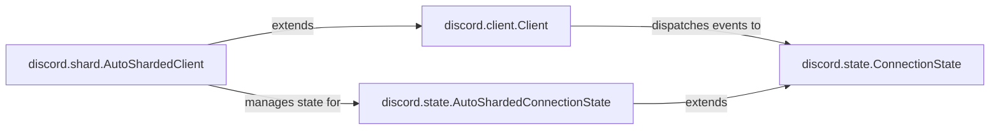

## Component Details

The State Cache subsystem is responsible for maintaining a consistent and up-to-date view of the Discord data, including guilds, channels, users, and messages. It processes events received from the Gateway and updates the internal state accordingly. This state is then used by other components of the bot to understand and react to changes in the Discord environment. The core of this system revolves around the `ConnectionState` class, which manages the cache and handles event parsing. `AutoShardedConnectionState` extends this to manage state across multiple shards. The `Client` and `AutoShardedClient` classes are responsible for connecting to the gateway and dispatching events to the state management components.

### discord.state.ConnectionState
The ConnectionState class is responsible for managing the state of the Discord client's connection, including caching data about guilds, channels, members, and messages. It handles parsing events received from the Discord gateway and updating its internal state accordingly. It also provides methods for accessing and querying the cached data.
- **Related Classes/Methods**: `discord.state.ConnectionState` (174:1835), `discord.state.ConnectionState.__init__` (180:275), `discord.state.ConnectionState.add_dm_channel` (513:517), `discord.state.ConnectionState._add_guild_from_data` (529:532), `discord.state.ConnectionState._get_guild_channel` (538:551), `discord.state.ConnectionState._update_poll_results` (560:579), `discord.state.ConnectionState.query_members` (587:606), `discord.state.ConnectionState._delay_ready` (608:654), `discord.state.ConnectionState.parse_ready` (656:679), `discord.state.ConnectionState.parse_message_create` (684:693), `discord.state.ConnectionState.parse_message_delete` (695:702), `discord.state.ConnectionState.parse_message_update` (718:744), `discord.state.ConnectionState.parse_message_reaction_add` (746:770), `discord.state.ConnectionState.parse_message_reaction_remove_all` (772:780), `discord.state.ConnectionState.parse_message_reaction_remove` (782:798), `discord.state.ConnectionState.parse_message_reaction_remove_emoji` (800:814), `discord.state.ConnectionState.parse_channel_delete` (870:889), `discord.state.ConnectionState.parse_channel_update` (891:916), `discord.state.ConnectionState.parse_channel_create` (918:933), `discord.state.ConnectionState.parse_channel_pins_update` (935:954), `discord.state.ConnectionState.parse_thread_create` (956:973), `discord.state.ConnectionState.parse_thread_update` (975:995), `discord.state.ConnectionState.parse_thread_delete` (997:1010), `discord.state.ConnectionState.parse_thread_list_sync` (1012:1046), `discord.state.ConnectionState.parse_thread_member_update` (1048:1062), `discord.state.ConnectionState.parse_thread_members_update` (1064:1096), `discord.state.ConnectionState.parse_guild_member_add` (1098:1111), `discord.state.ConnectionState.parse_guild_member_remove` (1113:1130), `discord.state.ConnectionState.parse_guild_member_update` (1132:1159), `discord.state.ConnectionState.parse_guild_emojis_update` (1161:1172), `discord.state.ConnectionState.parse_guild_stickers_update` (1174:1185), `discord.state.ConnectionState.parse_guild_audit_log_entry_create` (1187:1203), `discord.state.ConnectionState.parse_auto_moderation_rule_create` (1205:1213), `discord.state.ConnectionState.parse_auto_moderation_rule_update` (1215:1223), `discord.state.ConnectionState.parse_auto_moderation_rule_delete` (1225:1233), `discord.state.ConnectionState.parse_auto_moderation_action_execution` (1235:1243), `discord.state.ConnectionState._get_create_guild` (1245:1256), `discord.state.ConnectionState.chunk_guild` (1262:1263), `discord.state.ConnectionState._chunk_and_dispatch` (1289:1300), `discord.state.ConnectionState.parse_guild_create` (1311:1331), `discord.state.ConnectionState.parse_guild_update` (1333:1340), `discord.state.ConnectionState.parse_guild_delete` (1342:1362), `discord.state.ConnectionState.parse_guild_ban_add` (1364:1378), `discord.state.ConnectionState.parse_guild_ban_remove` (1380:1384), `discord.state.ConnectionState.parse_guild_role_create` (1386:1395), `discord.state.ConnectionState.parse_guild_role_delete` (1397:1408), `discord.state.ConnectionState.parse_guild_role_update` (1410:1421), `discord.state.ConnectionState.parse_guild_members_chunk` (1423:1446), `discord.state.ConnectionState.parse_guild_integrations_update` (1448:1453), `discord.state.ConnectionState.parse_integration_create` (1455:1463), `discord.state.ConnectionState.parse_integration_update` (1465:1473), `discord.state.ConnectionState.parse_integration_delete` (1475:1482), `discord.state.ConnectionState.parse_webhooks_update` (1484:1495), `discord.state.ConnectionState.parse_stage_instance_create` (1497:1504), `discord.state.ConnectionState.parse_stage_instance_update` (1506:1517), `discord.state.ConnectionState.parse_stage_instance_delete` (1519:1529), `discord.state.ConnectionState.parse_guild_scheduled_event_create` (1531:1538), `discord.state.ConnectionState.parse_guild_scheduled_event_update` (1540:1551), `discord.state.ConnectionState.parse_guild_scheduled_event_delete` (1553:1559), `discord.state.ConnectionState.parse_guild_scheduled_event_user_add` (1561:1578), `discord.state.ConnectionState.parse_guild_scheduled_event_user_remove` (1580:1597), `discord.state.ConnectionState.parse_guild_soundboard_sound_create` (1599:1607), `discord.state.ConnectionState.parse_guild_soundboard_sound_update` (1614:1625), `discord.state.ConnectionState.parse_guild_soundboard_sound_delete` (1627:1639), `discord.state.ConnectionState.parse_guild_soundboard_sounds_update` (1641:1654), `discord.state.ConnectionState.parse_voice_state_update` (1660:1684), `discord.state.ConnectionState.parse_voice_channel_effect_send` (1686:1692), `discord.state.ConnectionState.parse_voice_server_update` (1694:1700), `discord.state.ConnectionState.parse_typing_start` (1702:1722), `discord.state.ConnectionState.parse_message_poll_vote_add` (1736:1752), `discord.state.ConnectionState.parse_message_poll_vote_remove` (1754:1770), `discord.state.ConnectionState._get_reaction_user` (1784:1787), `discord.state.ConnectionState.get_channel` (1812:1823)

### discord.client.Client
The Client class represents the main client interface for interacting with the Discord API. It handles dispatching events to registered listeners and manages the connection to the Discord gateway. The `dispatch` method is central to the event processing loop, routing events to the appropriate handlers.
- **Related Classes/Methods**: `discord.client.Client` (153:3289), `discord.client.Client.dispatch` (501:539)

### discord.state.AutoShardedConnectionState
The AutoShardedConnectionState class extends ConnectionState to handle sharded connections to the Discord gateway. It is responsible for managing the state of multiple shards and ensuring that events are properly routed to the correct shard. It overrides some methods from ConnectionState to account for sharding.
- **Related Classes/Methods**: `discord.state.AutoShardedConnectionState` (1838:1983), `discord.state.AutoShardedConnectionState.parse_ready` (1939:1979), `discord.state.AutoShardedConnectionState.__init__` (1839:1845)

### discord.shard.AutoShardedClient
The AutoShardedClient class extends Client to automatically manage sharding of the Discord client. It handles connecting to the Discord gateway with multiple shards and distributing events across them. The `connect` method initiates the connection process.
- **Related Classes/Methods**: `discord.shard.AutoShardedClient` (325:638), `discord.shard.AutoShardedClient.connect` (511:533)