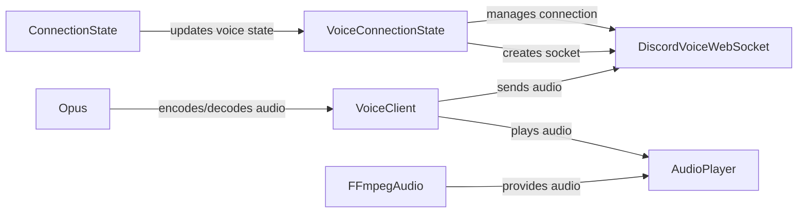

## Component Details

The Voice Manager subsystem is responsible for handling all voice-related functionalities within the Discord bot. It manages the bot's connection to voice channels, including establishing and maintaining the connection, handling voice events, and providing an interface for playing audio. The core components work together to encode, send, and receive audio packets, ensuring seamless voice communication.

### VoiceClient
Represents the client's connection to a voice channel. It handles audio encryption, playing audio, and sending audio packets to the voice server. It uses Opus for encoding and interacts with AudioPlayer for managing audio playback.
- **Related Classes/Methods**: `discord.voice_client.VoiceClient` (191:591), `discord.voice_client.VoiceClient.__init__` (218:235), `discord.voice_client.VoiceClient.disconnect` (335:342), `discord.voice_client.VoiceClient._encrypt_aead_xchacha20_poly1305_rtpsize` (384:394), `discord.voice_client.VoiceClient._encrypt_xsalsa20_poly1305_lite` (413:422), `discord.voice_client.VoiceClient.play` (424:516), `discord.voice_client.VoiceClient.send_audio_packet` (560:591)

### VoiceConnectionState
Manages the state of a voice connection, including connection, disconnection, and reconnection logic. It handles voice state and server updates received from the gateway, manages socket listeners, and creates and polls voice websockets (DiscordVoiceWebSocket). It interacts with ConnectionState to parse voice updates.
- **Related Classes/Methods**: `discord.voice_state.VoiceConnectionState` (187:688), `discord.voice_state.VoiceConnectionState.__init__` (190:220), `discord.voice_state.VoiceConnectionState.voice_state_update` (255:306), `discord.voice_state.VoiceConnectionState.voice_server_update` (308:361), `discord.voice_state.VoiceConnectionState.connect` (363:380), `discord.voice_state.VoiceConnectionState._wrap_connect` (382:396), `discord.voice_state.VoiceConnectionState._inner_connect` (398:424), `discord.voice_state.VoiceConnectionState._connect` (426:436), `discord.voice_state.VoiceConnectionState.disconnect` (438:481), `discord.voice_state.VoiceConnectionState.soft_disconnect` (483:503), `discord.voice_state.VoiceConnectionState.move_to` (505:527), `discord.voice_state.VoiceConnectionState.wait_async` (532:533), `discord.voice_state.VoiceConnectionState.add_socket_listener` (541:543), `discord.voice_state.VoiceConnectionState.remove_socket_listener` (545:547), `discord.voice_state.VoiceConnectionState._create_socket` (589:592), `discord.voice_state.VoiceConnectionState._poll_voice_ws` (594:656), `discord.voice_state.VoiceConnectionState._potential_reconnect` (658:681)

### DiscordVoiceWebSocket
Handles the websocket connection for voice communication. It manages connection, disconnection, protocol selection, and sending voice data. It is responsible for low-level communication with the Discord voice server.
- **Related Classes/Methods**: `discord.gateway.DiscordVoiceWebSocket` (769:1046), `discord.gateway.DiscordVoiceWebSocket.resume` (845:855), `discord.gateway.DiscordVoiceWebSocket.identify` (857:868), `discord.gateway.DiscordVoiceWebSocket.from_connection_state` (871:894), `discord.gateway.DiscordVoiceWebSocket.select_protocol` (896:909), `discord.gateway.DiscordVoiceWebSocket.client_connect` (911:919), `discord.gateway.DiscordVoiceWebSocket.speak` (921:931), `discord.gateway.DiscordVoiceWebSocket.received_message` (933:953), `discord.gateway.DiscordVoiceWebSocket.initial_connection` (955:971), `discord.gateway.DiscordVoiceWebSocket.load_secret_key` (1020:1027), `discord.gateway.DiscordVoiceWebSocket.poll_event` (1029:1039), `discord.gateway.DiscordVoiceWebSocket.close` (1041:1046)

### AudioPlayer
Manages the playback of audio sources. It handles starting, stopping, pausing, and resuming audio playback. It receives audio data from sources like FFmpegAudio and sends it to the VoiceClient for transmission.
- **Related Classes/Methods**: `discord.player.AudioPlayer._do_run` (727:771), `discord.player.AudioPlayer.run` (773:781), `discord.player.AudioPlayer.stop` (795:798), `discord.player.AudioPlayer.pause` (800:803), `discord.player.AudioPlayer.resume` (805:810), `discord.player.AudioPlayer.set_source` (818:822)

### Opus
Handles encoding and decoding audio using the Opus codec. It includes functionalities for loading the Opus library, encoding, decoding, and setting audio parameters. It is used by VoiceClient to encode audio before sending it over the network.
- **Related Classes/Methods**: `discord.opus` (full file reference), `discord.opus._load_default` (226:241), `discord.opus.load_opus` (244:280), `discord.opus._OpusStruct.get_opus_version` (330:334), `discord.opus.Encoder.__init__` (338:369), `discord.opus.Decoder.__init__` (419:422), `discord.opus.Decoder.set_gain` (461:465), `discord.opus.Decoder.set_volume` (467:469), `discord.opus.Decoder.decode` (479:480)

### FFmpegAudio
Provides audio sources using FFmpeg. It handles initializing FFmpeg, cleaning up resources, and creating audio streams. It provides audio data to the AudioPlayer.
- **Related Classes/Methods**: `discord.player.AudioSource.__del__` (117:118), `discord.player.FFmpegAudio.__init__` (151:199), `discord.player.FFmpegAudio.cleanup` (268:270), `discord.player.FFmpegPCMAudio.__init__` (313:345), `discord.player.FFmpegOpusAudio.__init__` (423:466), `discord.player.FFmpegOpusAudio.from_probe` (469:533)

### ConnectionState
Parses voice state and server updates received from the gateway and updates the internal state of the client. It provides the necessary information for VoiceConnectionState to manage the voice connection.
- **Related Classes/Methods**: `discord.state.ConnectionState.parse_voice_state_update` (1660:1684), `discord.state.ConnectionState.parse_voice_channel_effect_send` (1686:1692), `discord.state.ConnectionState.parse_voice_server_update` (1694:1700)