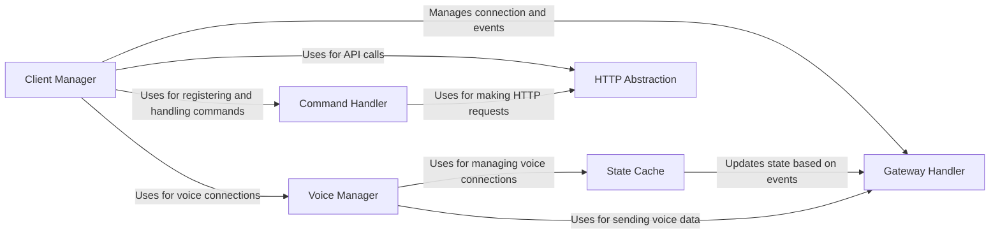

## Component Details

The discord.py library provides a comprehensive interface for interacting with the Discord API, enabling developers to create powerful and feature-rich Discord bots. The library abstracts away the complexities of the Discord API, providing a high-level interface for common tasks such as sending messages, managing channels, handling events, and interacting with voice channels. It is designed to be modular and extensible, allowing developers to customize and extend the library to meet their specific needs.

### Client Manager
The Client Manager is the central component responsible for managing the bot's connection to Discord, handling user authentication, and dispatching events to other components. It serves as the primary interface for interacting with the Discord API and orchestrates the overall lifecycle of the bot, including connecting to the gateway, handling reconnections, and managing sharding.
- **Related Classes/Methods**: `discord.client.Client` (153:3289), `discord.client.Client:run` (826:911), `discord.client.Client:connect` (668:764), `discord.client.Client:login` (620:666), `discord.shard.AutoShardedClient` (325:638), `discord.shard.AutoShardedClient:connect` (511:533), `discord.shard.AutoShardedClient:launch_shards` (487:505)

### Gateway Handler
The Gateway Handler is responsible for managing the WebSocket connection to Discord's Gateway. It handles sending and receiving events, heartbeating to maintain the connection, and implementing reconnection logic to ensure a stable connection. This component is crucial for real-time communication with Discord's servers.
- **Related Classes/Methods**: `discord.gateway.DiscordWebSocket` (245:763), `discord.gateway.DiscordWebSocket:send` (657:659), `discord.gateway.DiscordWebSocket:received_message` (490:599), `discord.gateway.DiscordWebSocket:close` (757:763), `discord.gateway.DiscordVoiceWebSocket` (769:1046), `discord.gateway.DiscordVoiceWebSocket:send` (336:339), `discord.gateway.DiscordVoiceWebSocket:received_message` (933:953), `discord.gateway.DiscordVoiceWebSocket:close` (1041:1046)

### State Cache
The State Cache maintains the bot's internal state, including guilds, channels, users, and messages. It processes events received from the Gateway Handler and updates the state accordingly, providing a consistent and up-to-date view of the Discord data for other components to use. This component is essential for the bot to understand and react to changes in the Discord environment.
- **Related Classes/Methods**: `discord.state.ConnectionState` (174:1835), `discord.state.ConnectionState:parse_ready` (656:679), `discord.state.ConnectionState:parse_message_create` (684:693), `discord.state.AutoShardedConnectionState` (1838:1983)

### HTTP Abstraction
The HTTP Abstraction component handles making HTTP requests to the Discord API. It encapsulates rate limiting logic to prevent the bot from being rate limited by Discord, and it also handles error handling for API requests. This component provides a consistent interface for other components to interact with the Discord API endpoints.
- **Related Classes/Methods**: `discord.http.HTTPClient` (500:2773), `discord.http.HTTPClient:request` (572:779), `discord.http.HTTPClient:send_message` (861:871), `discord.http.HTTPClient:edit_message` (907:914)

### Command Handler
The Command Handler is responsible for managing application commands (slash commands and context menu commands) and text-based commands. It handles registering commands with Discord, parsing arguments provided by users, and invoking the appropriate command callbacks. This component provides a structured way to define and manage bot commands, making it easier for developers to create interactive and feature-rich bots.
- **Related Classes/Methods**: `discord.app_commands.tree.CommandTree` (111:1317), `discord.app_commands.tree.CommandTree:add_command` (287:412), `discord.app_commands.commands.Command` (568:1149), `discord.app_commands.commands.ContextMenu` (1152:1381), `discord.ext.commands.bot.BotBase` (161:1411), `discord.ext.commands.core.Command` (296:1290), `discord.ext.commands.context.Context` (109:1089)

### Voice Manager
The Voice Manager provides voice functionality, including connecting to voice channels, sending audio, and handling voice events. It manages the bot's voice connections and provides an interface for playing audio. This component relies on the Gateway Handler for establishing the voice connection and the State Cache for managing voice states.
- **Related Classes/Methods**: `discord.voice_client.VoiceClient` (191:591), `discord.voice_client.VoiceClient:connect` (305:308), `discord.voice_client.VoiceClient:play` (424:516), `discord.voice_state.VoiceConnectionState` (187:688), `discord.voice_state.VoiceConnectionState:connect` (363:380), `discord.voice_state.VoiceConnectionState:disconnect` (438:481)