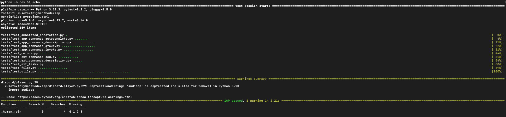
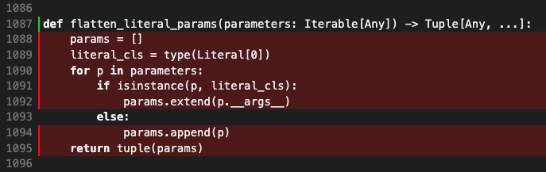
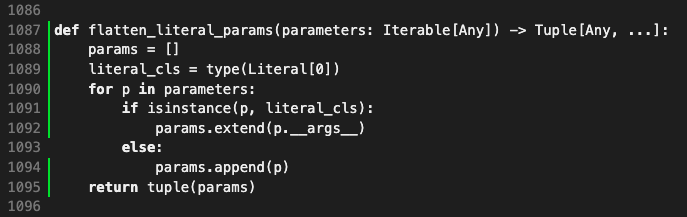
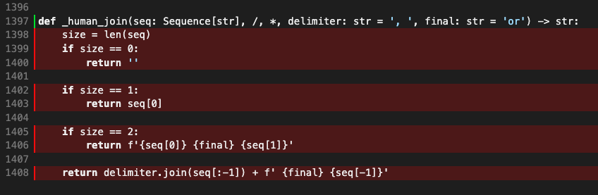
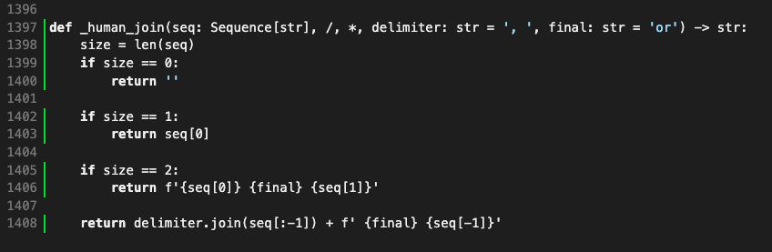

# Report for Assignment 1

## Project chosen

Name: discord.py

URL: https://github.com/Rapptz/discord.py

Number of lines of code and the tool used to count it: 68275 using `lizard discord tests setup.py`

Programming language: Python

## Coverage measurement

### Existing tool

The coverage tool [coverage.py](https://coverage.readthedocs.io/en/7.5.3/) was used for this project.
After installing the dependencies and executing `coverage run -m pytest` we get the following output:

Running `coverage html` and opening the document in the browser gives the following:

### Your own coverage tool

<The following is supposed to be repeated for each group member>

<Group member name>

<Function 1 name>

<Show a patch (diff) or a link to a commit made in your forked repository that shows the instrumented code to gather coverage measurements>

<Provide a screenshot of the coverage results output by the instrumentation>

<Function 2 name>

<Provide the same kind of information provided for Function 1>

Thijmen

flatten_literal_params

[commit](https://github.com/tthijm/sep/commit/2afde74ee94eb7e6cdc476356aa41f1ca09d87cf)

\_human_join

[commit](https://github.com/tthijm/sep/commit/88c98ebc05c4d67bcdce7d3046ffa786f79b9284)

## Coverage improvement

### Individual tests

<The following is supposed to be repeated for each group member>

<Group member name>

<Test 1>

<Show a patch (diff) or a link to a commit made in your forked repository that shows the new/enhanced test>

<Provide a screenshot of the old coverage results (the same as you already showed above)>

<Provide a screenshot of the new coverage results>

<State the coverage improvement with a number and elaborate on why the coverage is improved>

<Test 2>

<Provide the same kind of information provided for Test 1>

Thijmen

test_flatten_literal_params

[commit](https://github.com/tthijm/sep/commit/18e8104041610c32f9dedff6740688c4d1934550) + [commit](https://github.com/tthijm/sep/commit/138ca9a4c4b0a5f8fba254271f6b913b80d20b95)

The coverage improvement is +100%.
The coverage has been improved, because `flatten_literal_params` used to not be tested, while the new `test_flatten_literal_params` considers every branch to be taken.

test\_\_human_join

[commit](https://github.com/tthijm/sep/commit/92796db0afb5feff4b51b3c7e4874c2ba0eae7b9)

The coverage improvement is +100%.
The coverage has been improved, because `_human_join` used to not be tested, while the new `test__human_join` considers every branch to be taken.

### Overall

<Provide a screenshot of the old coverage results by running an existing tool (the same as you already showed above)>

<Provide a screenshot of the new coverage results by running the existing tool using all test modifications made by the group>

## Statement of individual contributions

<Write what each group member did>
